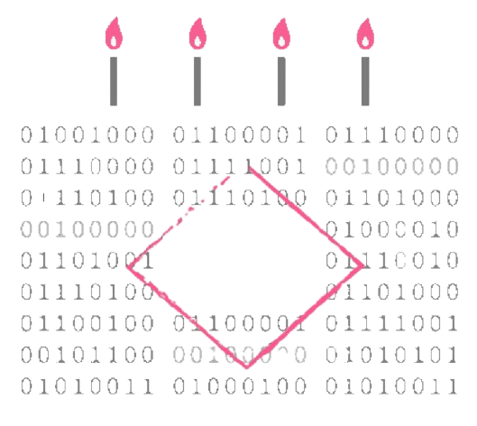

# Birthday - HackMyVM - Hard

## Maschineninformation

*   **Link zur VM:** [https://hackmyvm.eu/machines/machine.php?vm=Birthday](https://hackmyvm.eu/machines/machine.php?vm=Birthday)
*   **Schwierigkeitsgrad:** Hard

## Autor

*   **Pentest Report Author:** DarkSpirit

## Bericht Online

*   **Link zum detaillierten HTML Bericht:** [Birthday - HackMyVM - Hard Report](https://alientec1908.github.io/Birthday_HackMyVM_Hard/)

## Zusammenfassung

Dieser Bericht dokumentiert den Penetrationstest der HackMyVM-Maschine "Birthday", die als "Hard" eingestuft ist. Der Test umfasste die initiale Aufklärung (Reconnaissance), die detaillierte Analyse der Webanwendung (Web Enumeration), das Erringen des ersten Systemzugriffs (Initial Access) sowie die Ausweitung der Berechtigungen bis hin zum Administrator (Privilege Escalation), um schließlich die User- und Root-Flags zu erlangen.

## Gefundene Schwachstellen & Vorgehen

Der Weg zur vollständigen Kompromittierung der Maschine umfasste mehrere Phasen und die Ausnutzung unterschiedlicher Schwachstellen:

1.  **Reconnaissance:** Identifizierung der Ziel-IP im lokalen Netzwerk und Durchführung eines umfassenden Port- und Dienstscans mit Nmap, der offene Ports 22 (SSH) und 80 (HTTP) sowie detaillierte Versionsinformationen aufdeckte.
2.  **Web Enumeration:** Untersuchung der Webanwendung auf Port 80. Entdeckung einer Umleitung auf `/index.php` mit Parametern. Identifizierung der Seiten `birthday_calculator.php` (verarbeitet Datumsparameter) und `birthday_party_program.php` (verwendet einen `page`-Parameter).
3.  **Local File Inclusion (LFI) / Server-Side Request Forgery (SSRF):** Ausnutzung einer LFI-Schwachstelle auf `birthday_party_program.php` über den `page`-Parameter, die das Lesen lokaler Systemdateien wie `/etc/passwd` ermöglichte. Weiterhin wurde eine SSRF-Anfälligkeit auf derselben Seite bestätigt, die ausgehende Verbindungen zur Angreifer-Maschine erlaubte.
4.  **Command Injection:** Entdeckung einer Command Injection Schwachstelle auf `birthday_calculator.php` durch den `dob`-Parameter. Diese Schwachstelle konnte durch einen Bypass der `addslashes()`-Filterung über die Nutzung numerischer Indizes im `$GET` Request ausgenutzt werden.
5.  **Initial Access:** Nutzung der Command Injection auf `birthday_calculator.php`, um eine Reverse Shell als Benutzer `www-data` zur Angreifer-Maschine zu etablieren.
6.  **Privilege Escalation (Benutzer chloe):** Enumeration des Dateisystems und der Benutzer. Entdeckung, dass der Benutzer `www-data` den Befehl `/usr/bin/zodiac` über `sudo` als Benutzer `chloe` *ohne Passworteingabe* ausführen darf (`NOPASSWD`).
7.  **Privilege Escalation (Benutzer root):** Detaillierte Untersuchung des `/usr/bin/zodiac` Binary und seiner Abhängigkeit von `libzodiac.so`. Feststellung, dass die Systembibliothek `/lib/x86_64-linux-gnu/libzodiac.so` aufgrund fehlerhafter Dateiberechtigungen für "other" (zu denen `www-data` und `chloe` gehören) schreibbar war (`-rwxr-xrwx`). Erstellen einer bösartigen `libzodiac.so`, die beim Laden eine Shell ausführt, Kompilierung auf dem Zielsystem und Überschreiben der originalen Bibliothek. Ausführung von `/usr/bin/zodiac` (wahrscheinlich als `chloe` mittels `sudo -u chloe`) löste das Laden der bösartigen Bibliothek aus und gewährte eine Root-Shell.
8.  **Flags:** Erlangung der User-Flag im Home-Verzeichnis von `chloe` und der Root-Flag im Home-Verzeichnis von `root`.

## Verwendete Tools

*   arp-scan
*   vi
*   nmap
*   nikto
*   curl
*   wfuzz
*   ffuf
*   python3 http.server
*   nc
*   gcc
*   wget
*   dpkg-deb

## Berichtsdatum

13 Jun 2025
